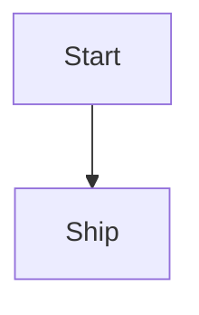

<!--
HOW TO USE THIS FILE
1. Copy it into _posts/ and rename to: YYYY-MM-DD-your-slug.md (the date prefix is required by Jekyll).
2. Put any images for this post in assets/img/postmortem/SLUG/ and update `cover:` above.
3. Delete `subtitle`, `tags` items or the whole `references` block if a post doesn't need them.
4. Write the body below in plain Markdown. This comment block itself won't render (it's inside a Markdown comment).
   Feel free to delete it once you're used to the format.

To preview an unpublished draft locally before it's live: `bundle exec jekyll serve --drafts`
-->

Write the post body here in Markdown.

## A heading

Regular paragraph text.

- bullet
- points

Add an image:

Add a Mermaid diagram (just a normal fenced code block, no special syntax):

Add a YouTube video:


