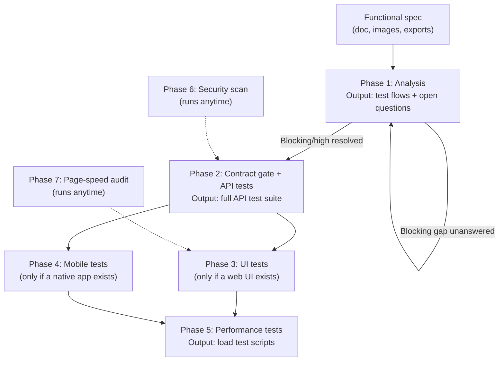

Every phase in this pipeline runs on the same rule the whole system is built around: nothing gets generated on a guess. If a functional spec leaves a gap, the pipeline asks about it instead of filling it in, and if the answer never comes, that gap stays visibly open rather than quietly turning into a test nobody actually agreed to.

That rule is what makes it workable to hand over a functional document and get back a test suite spanning API, UI, mobile, performance and security, without spending the next sprint discovering which parts of it were invented along the way.

## The phase map

## What happens where

**Analysis.** Takes the functional document, in whatever format it arrives, and produces test flows plus a structured question log. Questions are triaged by severity, and blocking or high-severity gaps have to be resolved, one round at a time, before anything downstream gets generated. Leave one blank and it's marked pending, not assumed. The analysis simply runs again once the real answer exists.

**Contract and API tests.** Nothing gets built on top of an API contract until it clears a linting gate. Once it does, this phase generates realistic test data per entity and a full assertion suite: happy path, authentication, role-based access, validation, not-found handling, and checks that specifically try to make one user reach another user's data.

**UI and mobile, both conditional.** These only run if the project actually has a web interface or a native mobile app. Each produces two things per screen: functional coverage and an accessibility pass, so accessibility isn't a separate initiative bolted on afterward.

**Performance.** This is the one phase that refuses to guess at load numbers out of thin air. It reads two plain-language questions answered back in the analysis phase, who uses the system and what would hurt most if it broke, and derives concurrency targets and SLAs from that, instead of defaulting to an arbitrary number of virtual users.

**Security and page-speed, both independent.** Neither depends on the phases before it, and both can run at any point once there's a live environment to point them at. One scans for real vulnerabilities against the running API; the other measures actual page performance and reports specifically what's slow and why.

## Why the branching matters more than the count

The interesting part isn't that there are seven phases, it's that most of them are conditional or independent. A backend-only service skips UI and mobile entirely. A project with no agreed SLAs still gets a performance suite, just one honestly labeled as a default instead of a false promise of precision. That shape, generate what applies, skip what doesn't, gate what's uncertain, is the same judgment I'd apply running this by hand. The pipeline just holds the line on it at a scale a manual process never could.
